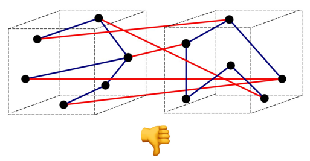
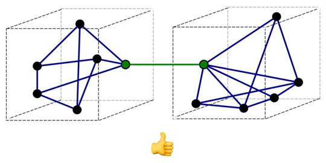
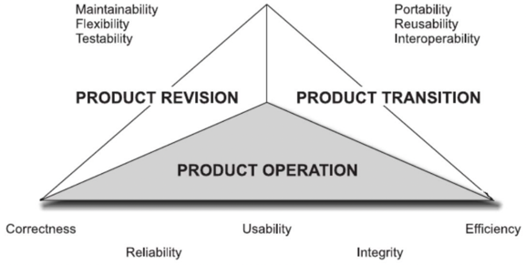

# Principios de Diseño

## Modularización

### Keywords
- Functional decomposition vs. design decision decomposition
- Module (abstraction): Comprensión, coordinación, flexibilidad.
- David parnas: Information hiding and encapsulation.
- Coupling & cohesion.
- Ortogonalidad.

### Formas de modularización
- Dividir la función en sus pasos (Functional Decomposition)
- Dividir la función en decisiones de diseño: Cada sub-función oculta alguna decision 
  importante

### Definición
Dividir un programa en módulos individuales, creando barreras de abstracción bien 
definidas entre ellos.

### Beneficios
- __Comprensión__: Nos permite estudiar un módulo a la vez.
- __Coordinación__: Distintos módulos pueden ser desarrollados y mantenidos en forma 
  independiente por diferentes equipos.
- __Flexibilidad__: Debería ser posible hacer cambios a un módulo sin necesidad de cambiar
  otros.

#### ¿Qué tipos de cambios?
- Cambio de requerimientos a través del tiempo.
- Distintos usuarios que al mismo tiempo requieren diferente funcionalidad.

### Modularización segun David Parnas, 1972
- NO es simplemente dividir una función en múltiples pasos.
- __Information Hiding__: Cada módulo oculta decisiones de diseño.
- __Encapsulation__: Cada módulo expone una interfaz sin revelar detalles de implementación.
- Empezar la descomposición de un sistema por sus decisiones de diseño difíciles o que
  pueden cambiar. Luego se diseñan módulos para ocultar esas decisiones asi se separan
  del tiempo de ejecución.

### Acoplamiento
El grado en el cual los módulos se __interconectan__ o se relacionan entre ellos.

### Cohesión
El grado en el cual las componentes de un módulo son necesarios y suficientes para llevar
a cabo __una sola función__ bien definida.

### Criterio
- Alta __cohesión__ dentro de cada módulo.
- Bajo __acoplamiento__ entre módulos.

Alto acoplamiento. Baja cohesión


Bajo acoplamiento. Alta cohesión


### Ortogonalidad
Dos o más elementos son ortogonales si cambios en un elemento no afectan al resto.

#### Ejemplo
```scala
class Split1 {
    constructor(filename)
    def readNextLine()
    def getField(n)
}

class Split2 {
    constructor(line)
    def getField(n)
}
```

## Principios de Diseño

## Temas
- ¿Qué hace a un buen diseño?
- Calidad de software.
- Principios de Diseño.

### ¿Qué es un buen diseño?
El principio de la sabiduría de un ingeniero de software es reconocer la diferencia
entre conseguir que un programa funciones y que funcione correctamente.

### Calidad de Software - McCall's Classic Model for Software Quality Factors (1977)


#### Operational Factors
- Correctness: Funciona y hace lo que debe hacer.
- Reliability: Que sea confiable, que no se rompa, que no se caiga, que maneje bien 
  los errores. Hace lo que debe hacer siempre.
- Efficiency: Hace lo que debe hacer lo más rápido posible y con la menor cantidad
  de recursos.
- Integrity: Que no se caiga, que no permita invasiones de memoria. 
- Usability: Fácil de interactuar, que sea intuitivo, que las capacidades del sistema
  sean fáciles de descubrir por el usuario.

#### Revision Factors
- Maintainability: Codigo fácil de entender, monitoreo de software, alertas, manejo
  de errores, logs distribuidos.
- Flexibility: Adaptable a cambios futuros.
- Testability: Self explanatory.

#### Transition Factors
- Portability: Que todo o parte del codigo se pueda usar en distintos hardwares.
- Reusability: Reutilizar módulos para dar soluciones a otros problemas.
- Interoperability: Que el software pueda operar con otros softwares.

### Cualidades de un buen diseño
- Compatibility: Los componentes trabajan bien entre sí.
- Extensibility: Fácil de agregar funcionalidades.
- Fault-tolerance: Maneja errores elegantemente.
- Maintainability.
- Modularity: Soporta correctamente cambios en los componentes.
- Performance: Funciona según la necesidad.
- Portability.
- Reliability.
- Reusability.
- Robustness == Integrity (no se cae y no permite invasiones de memoria)
- Scalability: Mantiene la performance conforme sube la demanda.
- Security: Solo ocurre el comportamiento deseado.
- Usability.

### Principios de Diseño - Alan M. Davis
- Evaluar más de una alternativa.
- Cada elemento tiene que ser _traceable_ a un requerimiento.
- No debe reinventar la rueda. (KISS)
- Debe minimizar la distancia intelectual entre el software y el problema a resolver.
- Debe ser uniforme e integrado.
- Debe ser fácil de cambiar. (Modularity)
- Debe mantenerse simple y evitar la proliferación de casos especiales.
- Debe poder manejar errores y situaciones no previstas de manera elegante. (Fault-tolerance)
- La calidad del diseño debe asegurarse en el momento de la construcción y no una
  vez realizado.
- El diseño deber ser revisado para minimizar errores conceptuales.
- Registrar las suposiciones y decisiones importantes.

### DRY: Don't Repeat Yourself
> Every piece of knowledge must have a single, unambiguous, authoritative 
  representation within a system. - Andy Hunt & Dave Thomas (The Pragmatic Programmer)
- Código duplicado.
- Conocimiento duplicado.
- Representaciones duplicadas.
- Duplicados entre proyectos.

### KISS: Keep It Simple, Stupid
> Un sistema complejo que funciona invariablemente se ha desarrollado a partir de 
  un sistema simple que funciona. - John Gall (1975)

> You can't write perfect software. - Andy Hunt & Dave Thomas (The Pragmatic Programmer)

### Design by Contract (Bertrand Meyer)
- Preconditions.
- Postconditions.
- Class invariants.

### Defensive Design / Programming
- Validate all input/data.
- Expect malicious input/data.
- Validate assumptions.
- Expect and handle errors.

> Good design is easier to change than bad design. - Andy Hunt & Dave Thomas (The Pragmatic Programmer)

## Abstracción

###¿Qué es abstraer?
> Para la comprensión de fenómenos complejos, la herramienta más poderosa a disposición
del intelecto humano es la ABSTRACCIÓN, surge del reconocimiento de similitudes entre 
ciertos objetos, situaciones o procesos [...] y de concentrarse en estas similitudes
e ignorar por el momento las diferencias. - Hoare, 1972.

> In the case of programming, __the use__ which may be made of an abstraction __is relevant__;
__the way__ in which the abstraction __is implemented is irrelevant__. - Programing With 
Abstract Data Types. Barbara Liskov, 1974.

> The purpose of abstraction is not ot be vague, but to create a new semantic level 
in which one can be absolutely precise. - Edsger Dijkstra.

> Medios de abstracción: mediante los cuales se pueden nombrar elementos compuestos
y ser manipulados como unidades. - Structure and Interpretation of Commputer Programs.

### Ejemplos
- Nombrar una variable.
- Crear y nombrar funciones.
- Clasificar conceptos.
- Definir nuevos _tipos_.
- Crear "DSLs" (domain-specific-languages).
- Agrupar código en módulos.
- Modelar.

### Abstracción Procedural
- Creamos abstracciones al crear, componer y combinar funciones.
- Separamos el __qué__ del __cómo__.

### Abstracción de Datos
- Creamos abstracciones al componer datos en datos complejos.
- Separamos las __operaciones__ de la construcción interna del __dato__.

### "Niveles" de Abstracción
- En cada nivel ignoramos detalles de otros niveles.
- Barreras de abstracción.
- Cada nivel utiliza su propio "lenguajes"

Las "capas" de una aplicación no siempre definen abstracción.